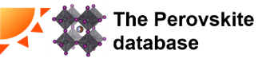
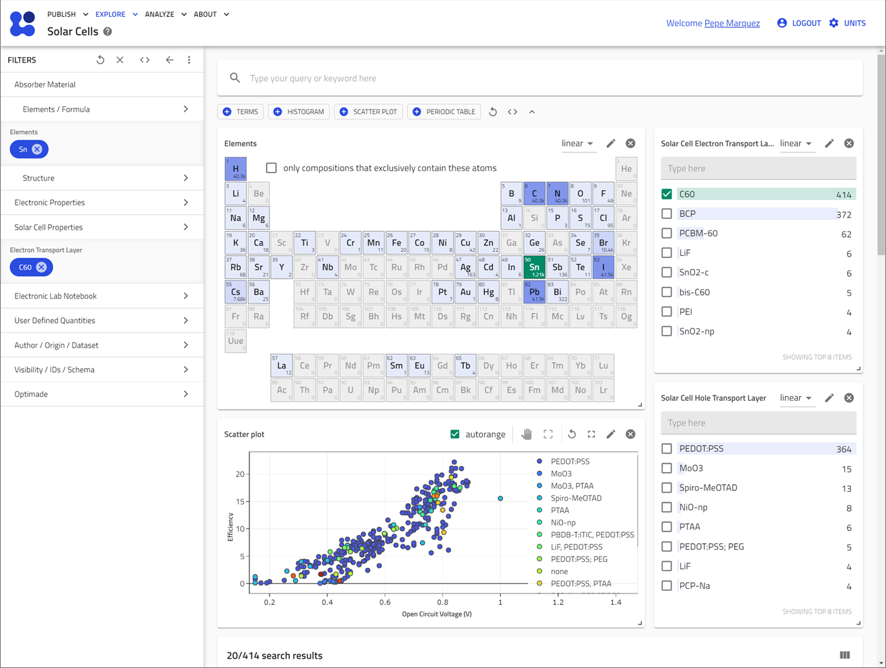

[](https://doi.org/10.5281/zenodo.16910883)
[![NOMAD](https://img.shields.io/badge/Open%20NOMAD-lightgray?logo=data:image/svg+xml;base64,PD94bWwgdmVyc2lvbj0iMS4wIiBlbmNvZGluZz0idXRmLTgiPz4KPCEtLSBHZW5lcmF0b3I6IEFkb2JlIElsbHVzdHJhdG9yIDI3LjUuMCwgU1ZHIEV4cG9ydCBQbHVnLUluIC4gU1ZHIFZlcnNpb246IDYuMDAgQnVpbGQgMCkgIC0tPgo8c3ZnIHZlcnNpb249IjEuMSIgaWQ9IkxheWVyXzEiIHhtbG5zPSJodHRwOi8vd3d3LnczLm9yZy8yMDAwL3N2ZyIgeG1sbnM6eGxpbms9Imh0dHA6Ly93d3cudzMub3JnLzE5OTkveGxpbmsiIHg9IjBweCIgeT0iMHB4IgoJIHZpZXdCb3g9IjAgMCAxNTAwIDE1MDAiIHN0eWxlPSJlbmFibGUtYmFja2dyb3VuZDpuZXcgMCAwIDE1MDAgMTUwMDsiIHhtbDpzcGFjZT0icHJlc2VydmUiPgo8c3R5bGUgdHlwZT0idGV4dC9jc3MiPgoJLnN0MHtmaWxsOiMxOTJFODY7c3Ryb2tlOiMxOTJFODY7c3Ryb2tlLXdpZHRoOjE0MS4zMjI3O3N0cm9rZS1taXRlcmxpbWl0OjEwO30KCS5zdDF7ZmlsbDojMkE0Q0RGO3N0cm9rZTojMkE0Q0RGO3N0cm9rZS13aWR0aDoxNDEuMzIyNztzdHJva2UtbWl0ZXJsaW1pdDoxMDt9Cjwvc3R5bGU+CjxwYXRoIGNsYXNzPSJzdDAiIGQ9Ik0xMTM2LjQsNjM2LjVjMTUwLjgsMCwyNzMuMS0xMjEuOSwyNzMuMS0yNzIuMlMxMjg3LjIsOTIuMSwxMTM2LjQsOTIuMWMtMTUwLjgsMC0yNzMuMSwxMjEuOS0yNzMuMSwyNzIuMgoJUzk4NS42LDYzNi41LDExMzYuNCw2MzYuNXoiLz4KPHBhdGggY2xhc3M9InN0MSIgZD0iTTEzMjksOTQ2Yy0xMDYuNC0xMDYtMjc4LjgtMTA2LTM4Ni4xLDBjLTk5LjYsOTkuMy0yNTguNywxMDYtMzY1LjEsMTguMWMtNi43LTcuNi0xMy40LTE2LjItMjEuMS0yMy45CgljLTEwNi40LTEwNi0xMDYuNC0yNzgsMC0zODQuOWMxMDYuNC0xMDYsMTA2LjQtMjc4LDAtMzg0LjlzLTI3OC44LTEwNi0zODYuMSwwYy0xMDcuMywxMDYtMTA2LjQsMjc4LDAsMzg0LjkKCWMxMDYuNCwxMDYsMTA2LjQsMjc4LDAsMzg0LjljLTYzLjIsNjMtODkuMSwxNTAtNzYuNywyMzIuMWM3LjcsNTcuMywzMy41LDExMy43LDc3LjYsMTU3LjZjMTA2LjQsMTA2LDI3OC44LDEwNiwzODYuMSwwCgljMTA2LjQtMTA2LDI3OC44LTEwNiwzODYuMSwwYzEwNi40LDEwNiwyNzguOCwxMDYsMzg2LjEsMEMxNDM1LjQsMTIyNCwxNDM1LjQsMTA1MiwxMzI5LDk0NnoiLz4KPC9zdmc+Cg==)](https://nomad-lab.eu/prod/v1/staging/gui/search/solarcells)

# NOMAD Perovskite Solar Cells Database
  [](https://nomad-lab.eu/prod/v1/staging/docs/plugins/plugins.html)

  [](https://www.perovskitedatabase.com/)


## Introduction
Welcome to the NOMAD plugin for the Perovskite Solar Cell Database.
This project aims to provide a FAIR and open-access interface for the perovskite solar cells database in NOMAD
and related data sources.
Additionally, it has data models and schemas for defining ions and halide hybrid-perovskite compositions.
The data can be accessed via the NOMAD API and explored in the [NOMAD Solar Cell Search App](https://nomad-lab.eu/prod/v1/staging/gui/search/solarcells).

  [](https://nomad-lab.eu/prod/v1/staging/gui/search/solarcells)

Information about the original database is available at [perovskitedatabase.com](https://www.perovskitedatabase.com/).

## Search applications

| 🔍 **Search Application** | 📝 **Description** | 💻 **Code** | 📄 **Metadata Definitions** |
|---------------------------|--------------------|------------------------|----------------------------|
| [The Perovskite Solar Database](https://nomad-lab.eu/prod/v1/develop/gui/search/perovskite-solar-cells-database) | Explore the data from the perovskite database. | [App's code](https://github.com/FAIRmat-NFDI/nomad-perovskite-solar-cells-database/blob/main/src/perovskite_solar_cell_database/apps/perovskite_solar_cell_database_app.py) | [Metadata](https://nomad-lab.eu/prod/v1/develop/gui/analyze/metainfo/perovskite_solar_cell_database/section_definitions@perovskite_solar_cell_database.schema.PerovskiteSolarCell) |
| [Halide Perovskite Ions Database](https://nomad-lab.eu/prod/v1/develop/gui/search/perovskite-ions) | Search ions used in halide perovskites compounds | [App's code](https://github.com/FAIRmat-NFDI/nomad-perovskite-solar-cells-database/blob/main/src/perovskite_solar_cell_database/apps/perovskite_ions_app.py) | [Metadata](https://nomad-lab.eu/prod/v1/develop/gui/analyze/metainfo/perovskite_solar_cell_database/section_definitions@perovskite_solar_cell_database.composition.PerovskiteIon) |
| [Solar Cells](https://nomad-lab.eu/prod/v1/staging/gui/search/solarcells) | An application to explore solar cells | [App's code](https://github.com/FAIRmat-NFDI/nomad-perovskite-solar-cells-database/blob/main/src/perovskite_solar_cell_database/apps/solar_cell_app.py) | [Metadata](https://nomad-lab.eu/prod/v1/develop/gui/analyze/metainfo/nomad.datamodel.datamodel.EntryArchive/results/properties/optoelectronic/solar_cell) |


## Adding the plugin to a NOMAD (Oasis) installation

To add a new plugin to the docker image you should add it to the plugins table in the [`pyproject.toml`](pyproject.toml) file of a [NOMAD distribution repository](https://github.com/FAIRmat-NFDI/nomad-distro-template?tab=readme-ov-file).

Here you can put either plugins distributed to PyPI, e.g.

```toml
[project.optional-dependencies]
plugins = [
  "perovskite-solar-cell-database>=1.0.0",
]
```

or plugins in a git repository with either the commit hash

```toml
[project.optional-dependencies]
plugins = [
  "perovskite-solar-cell-database @ git+https://github.com/FAIRmat-NFDI/nomad-perovskite-solar-cells-database.git@4b10f9927fb51d5779a386727867c7542c54f3f7"]
```

or with a tag

```toml
[project.optional-dependencies]
plugins = [
  "perovskite-solar-cell-database @ git+https://github.com/FAIRmat-NFDI/nomad-perovskite-solar-cells-database.git@v1.0.0"
]
```

For more detailed installation instructions, visit our [docs for NOMAD plugins](https://nomad-lab.eu/prod/v1/develop/docs/howto/oasis/plugins_install.html).

## Developers

It's nice to not miss a ruff format before pushing your commits. To set up pre-commit hook:
```console
   pip install pre-commit
   pre-commit install
```

### Acknowledgments
Special thanks to Jinzhao Li and all contributors who have made this project possible.
This project is supported by the FAIRmat NFDI initiative and also by by the European Union as part of the SolMates project (Project Nr. 101122288).

 

## Related Resources
- [Original Paper on Nature Energy](https://www.nature.com/articles/s41560-021-00941-3)
- [NOMAD Documentation](https://nomad-lab.eu/prod/v1/staging/docs/)
