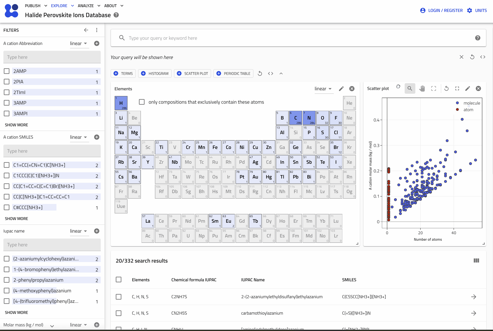
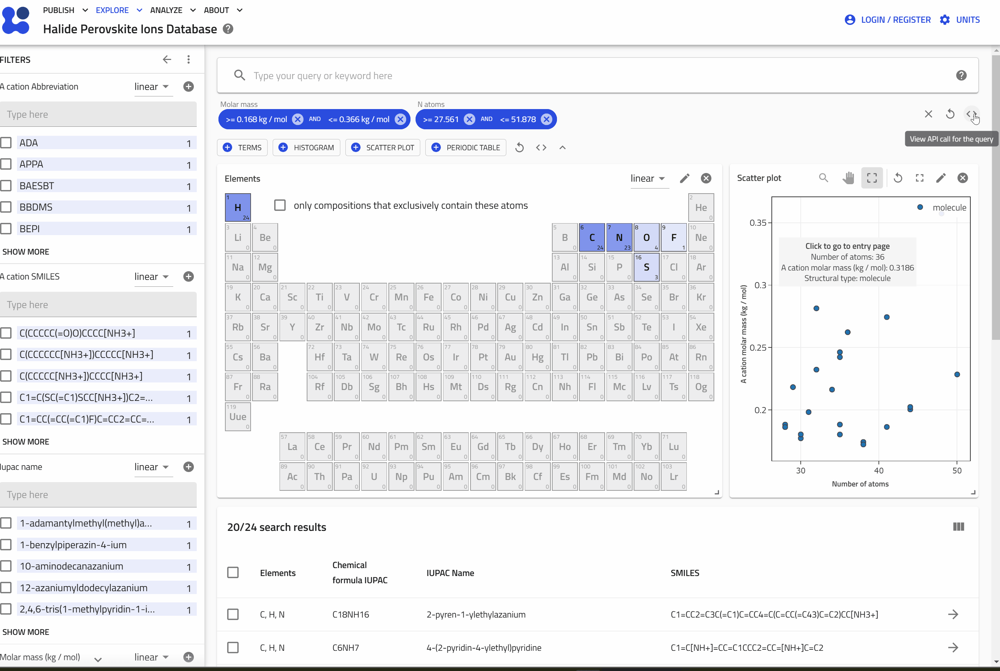

# Explore the Databases

The most efficient way to explore the databases is to use the search applications.

## Search Perovskite Solar Cells

Using the [Perovskite Database Project app](https://nomad-lab.eu/prod/v1/develop/gui/search/perovskite-solar-cells-database), you can combine different filters to find exactly what you need. For example, you can search for solar cells that contain Sn in the perovskite composition and where C60 has been used as an electron transport layer.

Once the results appear, you can navigate to individual entries by clicking on a row in the results table or directly on points of interest in the scatter plot.

## Search Ions

Similarly, you can explore the [Ion Database app](https://nomad-lab.eu/prod/v1/develop/gui/search/perovskite-ions) to find ions used in halide perovskites. Filters are available for elements, and you can use two-dimensional filters in the scatter plot to locate bulky ions with a large number of atoms and high molecular weight.

## Copy the Search Query for the API

If you need to work with larger datasets programmatically, the GUI provides tools to build API calls. Use the "Copy API call" `< >` button to copy the API call to your clipboard, and then paste it into your code.

For more information on using the API, check the [NOMAD API documentation](https://nomad-lab.eu/prod/v1/develop/docs/howto/programmatic/api.html).

