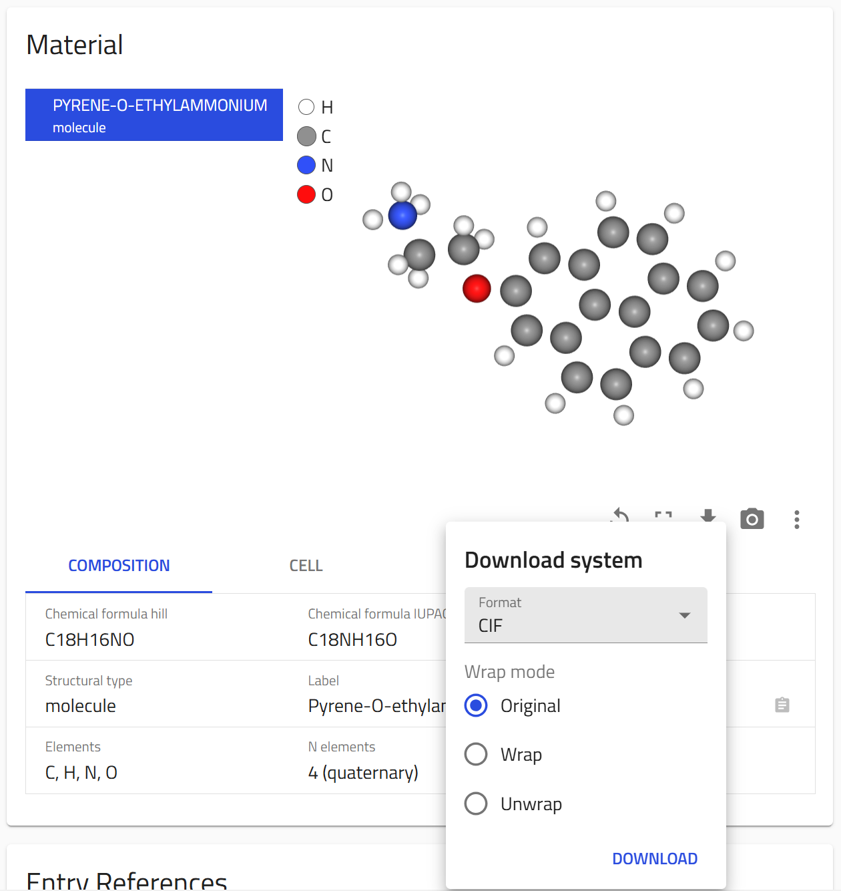

# Exporting structure files

For the [Halide Perovskite Ions Database](https://nomad-lab.eu/prod/v1/develop/gui/search/perovskite-ions) we have calculated the conformers of the molecules using the [RDKit Software](https://www.rdkit.org/). The structure files of these conformers can be downloaded directly from the overview page of the ion entry or [Programmatically using the NOMAD API](https://nomad-lab.eu/prod/v1/develop/api/v1/extensions/docs#/systems).

## Downloading structure files from the overview page



## Programmatically using the NOMAD API
Example for retrieving the structure of [Pyrene-O-ethylammonium](https://nomad-lab.eu/prod/v1/develop/gui/entry/id/ccun2zHQ49i6bA-RoTdK3U6mqBZM):

```python
import requests

# Define the base URL
base_url = 'https://nomad-lab.eu/prod/v1/develop/api/v1/systems'

# Specify the entry ID
entry_id = 'ccun2zHQ49i6bA-RoTdK3U6mqBZM'

# Define the query parameters
params = {
    'path': 'results/material/topology/0',
    'format': 'xyz',
    'wrap_mode': 'original'
}

# Construct the full URL by appending the entry ID
full_url = f'{base_url}/{entry_id}'

# Make the GET request with the specified parameters
response = requests.get(full_url, params=params)

# Check if the request was successful
if response.status_code == 200:
    # Process the response content
    data = response.content
    # For example, save the content to a file
    with open('output.xyz', 'wb') as file:
        file.write(data)
else:
    print(f'Error: {response.status_code}')
```

With this, you could write a script to download the structure files of the conformers of all the ions in the database.

