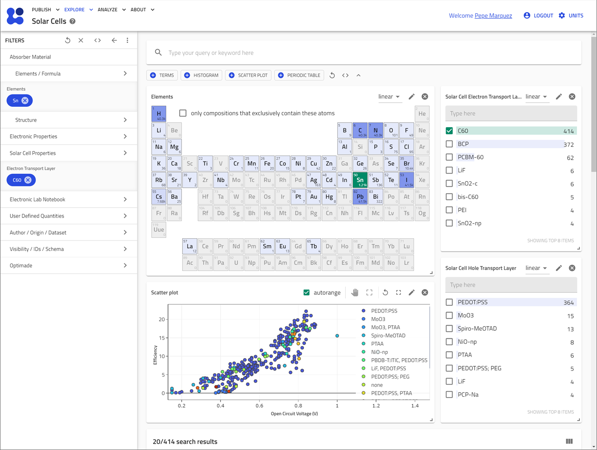

# Welcome to the `nomad-perovskite-solar-cells-database` documentation

[![NOMAD](https://img.shields.io/badge/Open%20NOMAD-lightgray?logo=data:image/svg+xml;base64,PD94bWwgdmVyc2lvbj0iMS4wIiBlbmNvZGluZz0idXRmLTgiPz4KPCEtLSBHZW5lcmF0b3I6IEFkb2JlIElsbHVzdHJhdG9yIDI3LjUuMCwgU1ZHIEV4cG9ydCBQbHVnLUluIC4gU1ZHIFZlcnNpb246IDYuMDAgQnVpbGQgMCkgIC0tPgo8c3ZnIHZlcnNpb249IjEuMSIgaWQ9IkxheWVyXzEiIHhtbG5zPSJodHRwOi8vd3d3LnczLm9yZy8yMDAwL3N2ZyIgeG1sbnM6eGxpbms9Imh0dHA6Ly93d3cudzMub3JnLzE5OTkveGxpbmsiIHg9IjBweCIgeT0iMHB4IgoJIHZpZXdCb3g9IjAgMCAxNTAwIDE1MDAiIHN0eWxlPSJlbmFibGUtYmFja2dyb3VuZDpuZXcgMCAwIDE1MDAgMTUwMDsiIHhtbDpzcGFjZT0icHJlc2VydmUiPgo8c3R5bGUgdHlwZT0idGV4dC9jc3MiPgoJLnN0MHtmaWxsOiMxOTJFODY7c3Ryb2tlOiMxOTJFODY7c3Ryb2tlLXdpZHRoOjE0MS4zMjI3O3N0cm9rZS1taXRlcmxpbWl0OjEwO30KCS5zdDF7ZmlsbDojMkE0Q0RGO3N0cm9rZTojMkE0Q0RGO3N0cm9rZS13aWR0aDoxNDEuMzIyNztzdHJva2UtbWl0ZXJsaW1pdDoxMDt9Cjwvc3R5bGU+CjxwYXRoIGNsYXNzPSJzdDAiIGQ9Ik0xMTM2LjQsNjM2LjVjMTUwLjgsMCwyNzMuMS0xMjEuOSwyNzMuMS0yNzIuMlMxMjg3LjIsOTIuMSwxMTM2LjQsOTIuMWMtMTUwLjgsMC0yNzMuMSwxMjEuOS0yNzMuMSwyNzIuMgoJUzk4NS42LDYzNi41LDExMzYuNCw2MzYuNXoiLz4KPHBhdGggY2xhc3M9InN0MSIgZD0iTTEzMjksOTQ2Yy0xMDYuNC0xMDYtMjc4LjgtMTA2LTM4Ni4xLDBjLTk5LjYsOTkuMy0yNTguNywxMDYtMzY1LjEsMTguMWMtNi43LTcuNi0xMy40LTE2LjItMjEuMS0yMy45CgljLTEwNi40LTEwNi0xMDYuNC0yNzgsMC0zODQuOWMxMDYuNC0xMDYsMTA2LjQtMjc4LDAtMzg0LjlzLTI3OC44LTEwNi0zODYuMSwwYy0xMDcuMywxMDYtMTA2LjQsMjc4LDAsMzg0LjkKCWMxMDYuNCwxMDYsMTA2LjQsMjc4LDAsMzg0LjljLTYzLjIsNjMtODkuMSwxNTAtNzYuNywyMzIuMWM3LjcsNTcuMywzMy41LDExMy43LDc3LjYsMTU3LjZjMTA2LjQsMTA2LDI3OC44LDEwNiwzODYuMSwwCgljMTA2LjQtMTA2LDI3OC44LTEwNiwzODYuMSwwYzEwNi40LDEwNiwyNzguOCwxMDYsMzg2LjEsMEMxNDM1LjQsMTIyNCwxNDM1LjQsMTA1MiwxMzI5LDk0NnoiLz4KPC9zdmc+Cg==)](https://nomad-lab.eu/prod/v1/staging/gui/search/solarcells)

## NOMAD Perovskite Solar Cells Database
  

### Introduction
Welcome to the NOMAD plugin for the Perovskite Solar Cell Database.
This project aims to provide a FAIR and open-access interface for the perovskite solar cells database in NOMAD
and related data sources.
Additionally, it has data models and schemas for defining ions and halide hybrid-perovskite compositions.
The data can be accessed via the NOMAD API and explored in the [NOMAD Solar Cell Search App](https://nomad-lab.eu/prod/v1/staging/gui/search/solarcells).

  

Information about the original database is available at [perovskitedatabase.com](https://www.perovskitedatabase.com/).

### Search applications

Search applications provide an efficient way to explore the databases. They are powered by
metadata definitions that define the structure of the data and allow for filtering and visualization.

| 🔍 **Search Application** | 📝 **Description** | 💻 **Code** | 📄 **Metadata Definitions** |
|---------------------------|--------------------|------------------------|----------------------------|
| [The Perovskite Database Project](https://nomad-lab.eu/prod/v1/develop/gui/search/perovskite-solar-cells-database) | Explore the data from the perovskite database. | [App's code](https://github.com/FAIRmat-NFDI/nomad-perovskite-solar-cells-database/blob/main/src/perovskite_solar_cell_database/apps/perovskite_solar_cell_database_app.py) | [Metadata](https://nomad-lab.eu/prod/v1/develop/gui/analyze/metainfo/perovskite_solar_cell_database/section_definitions@perovskite_solar_cell_database.schema.PerovskiteSolarCell) |
| [Halide Perovskite Ions Database](https://nomad-lab.eu/prod/v1/develop/gui/search/perovskite-ions) | Search ions used in halide perovskites compounds | [App's code](https://github.com/FAIRmat-NFDI/nomad-perovskite-solar-cells-database/blob/main/src/perovskite_solar_cell_database/apps/perovskite_ions_app.py) | [Metadata](https://nomad-lab.eu/prod/v1/develop/gui/analyze/metainfo/perovskite_solar_cell_database/section_definitions@perovskite_solar_cell_database.composition.PerovskiteIon) |
| [Solar Cells](https://nomad-lab.eu/prod/v1/staging/gui/search/solarcells) | An application to explore solar cells | [App's code](https://github.com/FAIRmat-NFDI/nomad-perovskite-solar-cells-database/blob/main/src/perovskite_solar_cell_database/apps/solar_cell_app.py) | [Metadata](https://nomad-lab.eu/prod/v1/develop/gui/analyze/metainfo/nomad.datamodel.datamodel.EntryArchive/results/properties/optoelectronic/solar_cell) |

### Tutorial

- [Sharing a perovskite composition](tutorial/sharing_a_perovskite_composition.md)

### How-to guides

How-to guides provide step-by-step instructions for a wide range of tasks:

- [Install this plugin](how_to/install_this_plugin.md)
- [Explore the databases](how_to/explore_the_databases.md)
- [Create a perovskite composition](how_to/create_a_perovskite_composition.md)
- [Add a new perovskite ion to the database](how_to/add_a_new_ion.md)
- [Export structure files](how_to/export_structures.md)
- [Download data](how_to/download_data.md)

### Example Notebooks

### Related Resources
- [Original Paper on Nature Energy](https://www.nature.com/articles/s41560-021-00941-3)
- [NOMAD Documentation](https://nomad-lab.eu/prod/v1/staging/docs/)
- Information about the original database is available at [perovskitedatabase.com](https://www.perovskitedatabase.com/).

### Acknowledgments
Special thanks to Jinzhao Li and all contributors who have made this project possible.
This project is supported by the FAIRmat NFDI initiative and also by by the European Union as part of the SolMates project (Project Nr. 101122288).

 